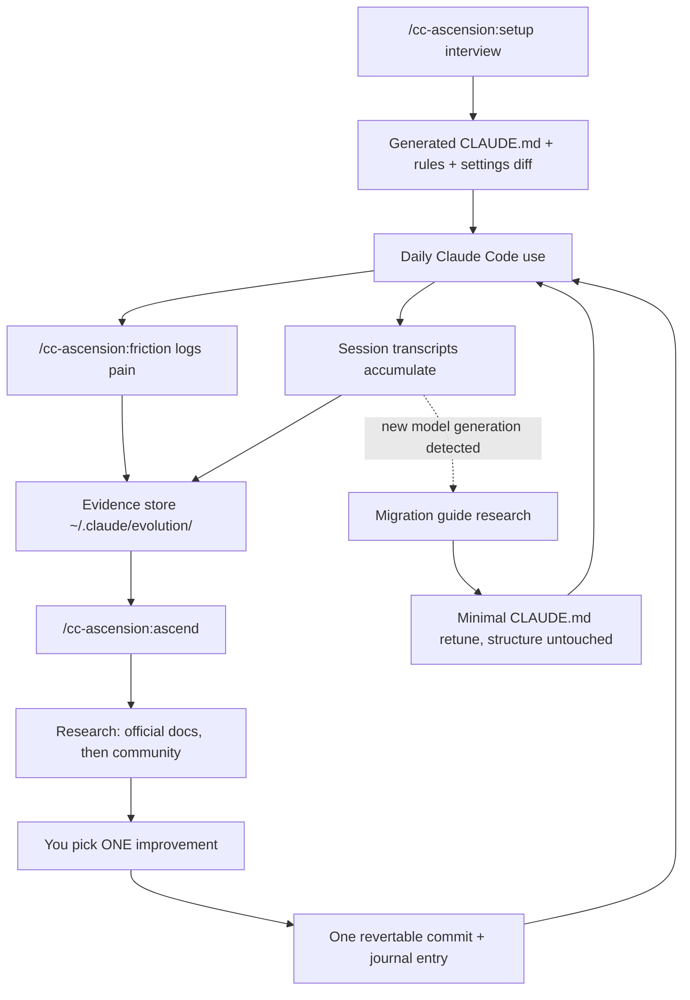

<p align="center">
  <picture>
    <source media="(prefers-color-scheme: dark)" srcset="assets/logo-dark.png">
    
  </picture>
</p>

# cc-ascension

**Claude Code config, generated from your own usage — not someone else's dotfiles.**

Most Claude Code setups start by copying a CLAUDE.md template or a friend's
dotfiles. It half-fits from day one — wrong stack, wrong model assumptions —
and rots, because nothing tells you what's actually causing friction.
cc-ascension builds your config from an interview about *your* workflow and
*your* primary model, then keeps it current by mining your own session
transcripts and logged pain points, researching fixes (official docs first),
and proposing one small, reversible improvement at a time. Every change cites
its sources or is flagged unverified — nothing is presented as fact without one.

## Contents

- [Install](#install)
- [What using it looks like](#what-using-it-looks-like)
- [How it works](#how-it-works)
- [Commands](#commands)
- [Is this for you?](#is-this-for-you)
- [Safety & privacy](#safety--privacy)
- [Requirements](#requirements)
- [Details → docs/REFERENCE.md](docs/REFERENCE.md) — what it touches, state
  layout, report reference, undo, troubleshooting, teams, FAQ

## Install

Needs Node ≥ 18 and Claude Code with plugin support.

```
/plugin marketplace add wraithyy/cc-ascension
/plugin install cc-ascension@cc-ascension
```

Run `/plugin` to confirm it loaded (or restart the session — commands load at
session start). Then run `/cc-ascension:setup` — **that is always the first
command.** Nothing is ever written without showing you the diff first; see
[Safety & privacy](#safety--privacy).

## What using it looks like

1. You run `/cc-ascension:setup`. It asks a handful of questions in your
   language (stack, team, which model you run daily, top annoyances, how
   autonomous Claude should be). If you already have a CLAUDE.md it asks
   merge-or-fresh. It shows you the CLAUDE.md and settings diff it wants to
   write — nothing is written until you approve.
2. You work normally. When Claude does something annoying, you type
   `/cc-ascension:friction "kept re-explaining our API auth pattern"`.
   One line gets logged, you go back to work.
3. Whenever friction has accumulated, you run `/cc-ascension:ascend`. It
   mines your recent sessions, reads your friction log, researches what
   surfaced, and shows a ranked list: "X happened 9 times this week; here's
   the docs link and the exact change I propose." You pick ONE. It applies it
   as a single revertable commit, journals it with sources, and stops.

Setup deliberately does **not** generate agent libraries, skill collections,
or hook suites. Those emerge later from `/ascend` cycles, backed by evidence
from your actual usage — the config grows from evidence, not templates.

## How it works



- Each `/ascend` cycle first compares the models seen in your sessions against
  a stored baseline — a new model generation (say Opus 4.x → 5) triggers a
  dedicated migration cycle: research the official migration guide, propose a
  minimal-diff retune of your CLAUDE.md (only model-specific wording changes),
  show the diff, stop.
- Otherwise it audits the config against evidence: unused agents/skills/hooks,
  model routing vs actual usage, repeated prompts that should become commands
  — including a supply-chain provenance check on every enabled plugin/MCP server.
- Candidates are ranked by evidence strength: friction events > miner data >
  community consensus > intuition. You always pick; it never batch-rewrites.

## Commands

| Command | When | What |
|---|---|---|
| `/cc-ascension:setup` | once, first | interview → generated config, shown before writing |
| `/cc-ascension:friction <text>` | the moment something hurts | logs one line of evidence |
| `/cc-ascension:ascend` | after friction accumulates | one evidence-backed improvement per cycle |

## Is this for you?

- Your CLAUDE.md has grown past what anyone reads before a session starts
- A new Claude model shipped and your old config feels like it fights the model
- You copy-pasted someone's dotfiles and don't know which parts earn their keep
- You keep hitting the same friction but never write it down

Two or more: run `/cc-ascension:setup`.

## Safety & privacy

The short version — full detail in
[docs/REFERENCE.md](docs/REFERENCE.md#what-it-touches):

- **Nothing is written without approval.** Every config change is shown as a
  diff first, applied as one revertable commit (chezmoi-aware if you use it).
- **Everything mined stays local.** Transcripts, reports, and the friction
  log never leave your machine; reports are gitignored by the offered
  `.gitignore`. The only network traffic is web research for citations.
- **Uninstall is clean.** Remove the plugin, delete `~/.claude/evolution/`,
  done — [undo guide](docs/REFERENCE.md#undo).

## Requirements

Node ≥ 18, Claude Code with plugin support. Backup scheduler: macOS (launchd)
or Linux (cron); everything else is OS-agnostic. State location can be moved
with `CC_ASCENSION_STATE` (default `~/.claude/evolution`).

Everything else — state directory layout, mining report flags and sections,
troubleshooting, teams, FAQ — lives in [docs/REFERENCE.md](docs/REFERENCE.md).
