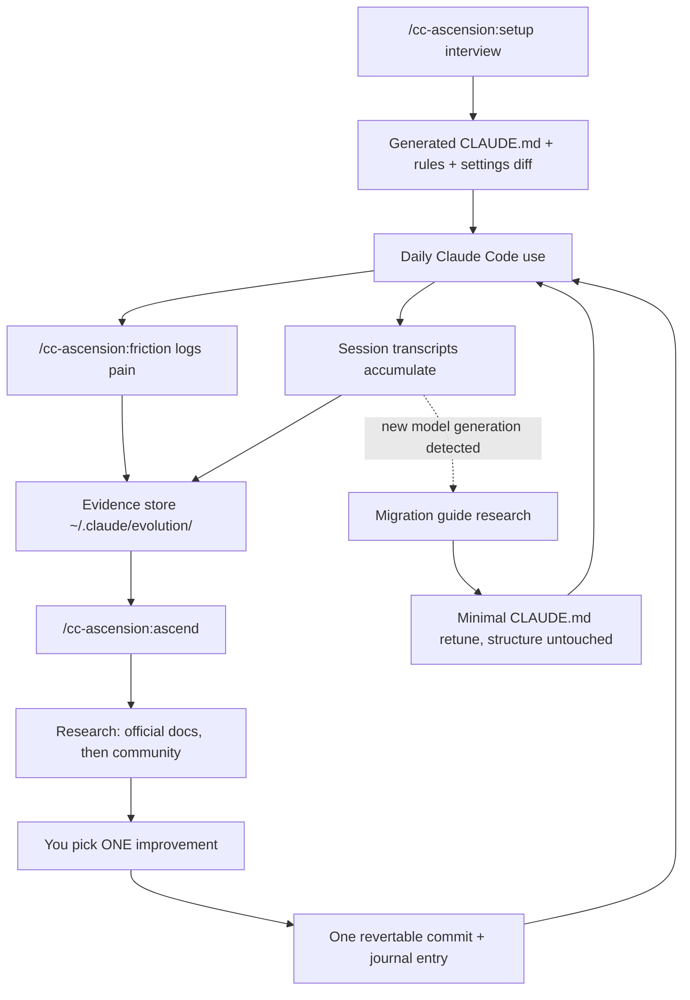

<p align="center">
  <picture>
    <source media="(prefers-color-scheme: dark)" srcset="assets/logo-dark.png">
    
  </picture>
</p>

# cc-ascension

**Claude Code config, generated from your own usage — not someone else's dotfiles.**

Most Claude Code setups start by copying a CLAUDE.md template or a friend's
dotfiles. It half-fits from day one — wrong stack, wrong model assumptions —
and rots, because nothing tells you what's actually causing friction.
cc-ascension builds your config from an interview about *your* workflow and
*your* primary model, then keeps it current by mining your own session
transcripts and logged pain points, researching fixes (official docs first),
and proposing one small, reversible improvement at a time. Every change cites
its sources or is flagged unverified — nothing is presented as fact without one.

## Install

```
/plugin marketplace add wraithyy/cc-ascension
/plugin install cc-ascension@cc-ascension
```

Run `/plugin` to confirm it loaded (or `/reload-plugins`). Then run
`/cc-ascension:setup` — **that is always the first command.**

## What using it looks like

1. You run `/cc-ascension:setup`. It asks a handful of questions in your
   language (stack, team, which model you run daily, top annoyances, how
   autonomous Claude should be). It shows you the CLAUDE.md and settings diff
   it wants to write — nothing is written until you approve.
2. You work normally. When Claude does something annoying, you type
   `/cc-ascension:friction "kept re-explaining our API auth pattern"`.
   One line gets logged, you go back to work.
3. Whenever friction has accumulated, you run `/cc-ascension:ascend`. It
   mines your recent sessions, reads your friction log, researches what
   surfaced, and shows a ranked list: "X happened 9 times this week; here's
   the docs link and the exact change I propose." You pick ONE. It applies it
   as a single revertable commit, journals it with sources, and stops.

Setup deliberately does **not** generate agent libraries, skill collections,
or hook suites. Those emerge later from `/ascend` cycles, backed by evidence
from your actual usage — the config grows from evidence, not templates.

## How it works



- Each `/ascend` cycle first compares the models seen in your sessions against
  a stored baseline — a new model generation (say Opus 4.x → 5) triggers a
  dedicated migration cycle: research the official migration guide, propose a
  minimal-diff retune of your CLAUDE.md (only model-specific wording changes),
  show the diff, stop.
- Otherwise it audits the config against evidence: unused agents/skills/hooks,
  model routing vs actual usage, repeated prompts that should become commands
  — including a supply-chain provenance check on every enabled plugin/MCP server.
- Candidates are ranked by evidence strength: friction events > miner data >
  community consensus > intuition. You always pick; it never batch-rewrites.

## Commands

| Command | When | What |
|---|---|---|
| `/cc-ascension:setup` | once, first | interview → generated config, shown before writing |
| `/cc-ascension:friction <text>` | the moment something hurts | logs one line of evidence |
| `/cc-ascension:ascend` | after friction accumulates | one evidence-backed improvement per cycle |

## Is this for you?

- Your CLAUDE.md has grown past what anyone reads before a session starts
- A new Claude model shipped and your old config feels like it fights the model
- You copy-pasted someone's dotfiles and don't know which parts earn their keep
- You keep hitting the same friction but never write it down

Two or more: run `/cc-ascension:setup`.

## What it touches

- **Reads**: `~/.claude/projects/*.jsonl` (your session transcripts),
  `~/.claude/plugins/installed_plugins.json`, chezmoi source files if chezmoi
  manages `~/.claude`.
- **Writes**: `~/.claude/evolution/` (journal, roadmap, friction log, reports,
  research notes); one config edit per `/ascend` cycle — always shown first.
- **Runs**: `claude mcp list`, `chezmoi source-path`/`diff` (if present),
  `git init` (offered, never forced), `rsync` + launchd/cron only if you opt
  into `scripts/install-backup.sh`.
- **Network**: `/ascend` and `/setup` do live web research to cite docs and
  migration guides — that is the only thing that leaves your machine. Mining
  and friction logging are fully local. Your transcripts are never transmitted.

Mining reports contain your project names and prompt prefixes; they are
gitignored by the offered `.gitignore` and marked "do not publish" — that
gitignore, not a promise, is the privacy mechanism.

## How your config is managed

- **chezmoi manages `~/.claude`** → edits go to the chezmoi source, then
  `chezmoi apply`. Live files are never edited directly (they'd be reverted
  by the next apply).
- **No chezmoi** → edits go to `~/.claude` with an offered `git init`, so
  every improvement is one `git revert` away. Setup recommends chezmoi once,
  never requires it.

## Undo

- Any `/ascend` change: `git revert` the commit (in `~/.claude` or your
  chezmoi source).
- Uninstall: `/plugin uninstall cc-ascension` removes the plugin; delete
  `~/.claude/evolution/` to remove all mined state. Nothing else is left.
- Backup job: `launchctl bootout gui/$(id -u) ~/Library/LaunchAgents/com.cc-ascension-backup.plist`
  (macOS) or remove the `cc-ascension-backup` line via `crontab -e` (Linux).

## For teams

cc-ascension is per-developer — it tunes your personal `~/.claude`, keyed to
your own sessions and model. Rollout to a team = each dev installs the plugin
and runs `/cc-ascension:setup` individually. Treat `~/.claude/evolution/` as
private; never check it into a shared repo.

## Requirements

Node ≥ 18, Claude Code with plugin support. Backup scheduler: macOS (launchd)
or Linux (cron); everything else is OS-agnostic. State location can be moved
with `CC_ASCENSION_STATE` (default `~/.claude/evolution`).

<details>
<summary><b>FAQ</b></summary>

**How often should I run `/ascend`?** No fixed cadence — run it when friction
has accumulated. Weekly is a fine default.

**Does it change things automatically?** No. Every write is shown first
(diffs for settings and CLAUDE.md retunes, ranked candidates for
improvements); you approve, it applies exactly one change, then stops.

**What if my transcripts get pruned before mining?** Claude Code keeps ~30
days. Run `scripts/install-backup.sh` for a long-term local mirror, then mine
with `--src`.

**What does the report contain?** Besides usage/cost tables: a "Delta since
last report" section (diffed against the previous run's JSON sidecar), a
"Friction candidates" section mined from transcripts (tool errors, permission
denials, interrupts, retry loops — weaker signal than explicit `/friction`
entries), and config health checks. Scripted/headless sessions (SDK
entrypoint, prompt bursts) are excluded from prompt stats; add
`--exclude-project <name>` for manual exclusions, `--no-health` to skip the
host config checks. Unknown model names are flagged instead of silently
priced. Run `node --test scripts/mine.test.mjs` to test the miner.

**Is any of my data sent anywhere?** No. Research fetches public docs; your
transcripts, reports, and friction log stay on disk, gitignored.

**`/cc-ascension:friction` is long to type.** Add a personal alias command,
e.g. `~/.claude/commands/f.md` that forwards its arguments to it.

</details>
